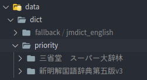

# Batch Anki Exporter

This is a script to make [anime cards]("https://www.animecards.site") on the fly with a single hotkey on linux. It takes a sentence from [yourei](https://www.yourei.jp), an image from [google images](https://www.google.com/imghp?hl=ja), an audio recording from [forvo](https://www.forvo.com), and finally, a couple meanings from yomichan dictionaries of your choice, which is all packaged into 1 card and sent directly to your anki.

## Installation

First, you need to install all the dependencies. This can be done with a simple command:

```
./scripts/build.sh
```

The next step is to set up the config in [config.yml](config.yml). All you have to do is fill in the missing blanks.
Here's an example config file:

```yml
anki:
    collection: "/home/username/.local/share/Anki2/profile1/collection.anki2"
    deck: "My Deck"
    note_type: "My Notetype"
    word_field: "Word"
    sentence_field: "Expression"
    image_field: "Picture"
    audio_field: "Audio"
    meaning_field: "Meaning"
    words_file: "/home/username/words.txt"
    failed_words_file: "/home/username/failed.txt"
```

Notes:

1. You need to type in the fields _exactly_ as it is in anki or else it will not work.
2. The collection is your profile's database
3. You have to close anki before running this script

Next, we need to setup the dictionaries that you will be using. There's 2 folders in the `dict` folder, fallback and priority. Priority is the folder where you will put your dicts that you want to search first. The dictionaries located in the fallback folder will be used if the program couldn't find any entries in your priority dicts.

Make sure you unzip the yomichan dictionaries to its own folder and move it to the appropriate directory inside `dict`. Here is an example of how it could look:



## Options

There are 2 options to use when running this script, `--word` and `--parsefile`.

1. The word flag (which is defaulted to true) is used to make an anki card from the word in your clipboard.
2. The parsefile flag is used to batch add cards from a txt file with the list of words.

Before running this script, you might need to click the downgrade and quit button in anki.

There's an easier way to run this program, and that is through the bash files in the[`scripts`](scripts) folder of this repo.

### Hotkey

Setting up a hotkey on Linux is actually really simple. Most desktop environments/window managers have a place for hotkeys in their system settings/config file. There are multiple scripts located in the [`scripts`](scripts) folder of this repo. Make a keybind that runs the file [`add-one.sh`](scripts/add-one.sh). This file with generate an anki card for the word in your clipboard.
